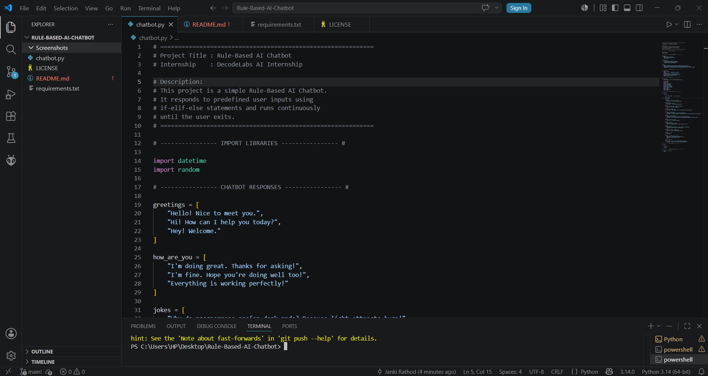
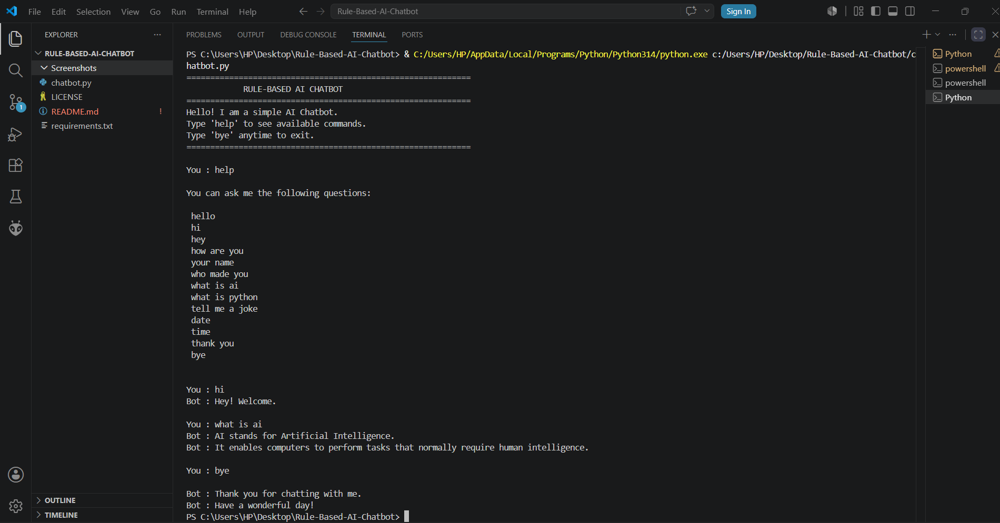

# 🤖 Rule-Based AI Chatbot

A simple Rule-Based AI Chatbot developed in Python as part of the DecodeLabs Artificial Intelligence Internship.

This chatbot responds to predefined user inputs using **if-elif-else statements** and keeps interacting with the user until an exit command is given. The project focuses on understanding the fundamentals of Artificial Intelligence through rule-based decision making.

---

## 📌 Project Objective

The objective of this project is to create a chatbot that can:

* Respond to greetings
* Answer basic predefined questions
* Display current date and time
* Provide a help menu
* Continue chatting until the user exits
* Demonstrate decision-making using Python control statements

---

## ✨ Features

* Interactive command-line chatbot
* Rule-based responses using `if-elif-else`
* Continuous conversation using a `while` loop
* Help menu
* Current date and time
* Random greeting and joke responses
* Friendly user interface
* Beginner-friendly Python code

---

## 🛠 Technologies Used

* Python 3
* Visual Studio Code
* Git & GitHub

---

## 📂 Project Structure

```
Rule-Based-AI-Chatbot/
│
├── chatbot.py
├── README.md
├── requirements.txt
├── .gitignore
├── LICENSE
└── screenshots/
```

---

## ▶️ How to Run the Project

### Clone the repository

```bash
git clone https://github.com/YOUR_USERNAME/Rule-Based-AI-Chatbot.git
```

### Open the project folder

```bash
cd Rule-Based-AI-Chatbot
```

### Run the chatbot

```bash
python chatbot.py
```

or

```bash
py chatbot.py
```

---

## 📸 Screenshots

### Chatbot Code



### Chatbot Output




## 💬 Sample Conversation

```
You : hello

Bot : Hello! Nice to meet you.

You : what is ai

Bot : AI stands for Artificial Intelligence.

You : time

Bot : Current time is 09:35 PM

You : bye

Bot : Thank you for chatting with me.
Bot : Have a wonderful day!
```

---

## 📖 Concepts Used

* Variables
* User Input
* String Handling
* if-elif-else Statements
* While Loop
* Functions
* Python Modules
* Random Responses
* Date and Time

---

## 🚀 Future Improvements

* Voice Assistant
* Graphical User Interface (GUI)
* Database Support
* Natural Language Processing (NLP)
* Machine Learning Integration

---

## 👩‍💻 Author

**Janki Rathod**

Artificial Intelligence Internship Project

DecodeLabs

---

## ⭐ Thank You

Thank you for visiting this repository. Feel free to explore the project and provide your valuable feedback.
